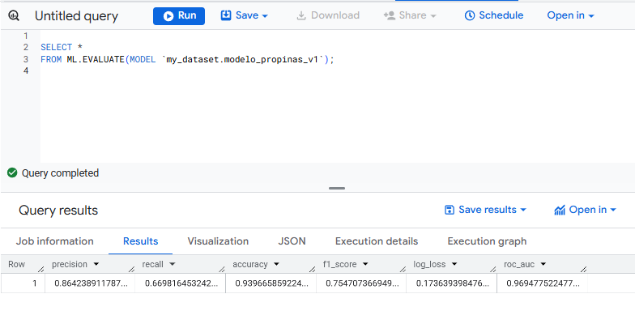
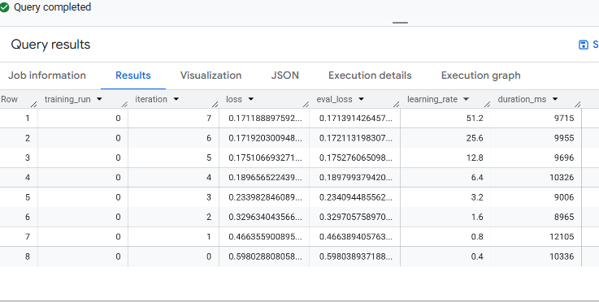
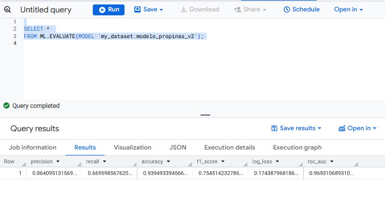
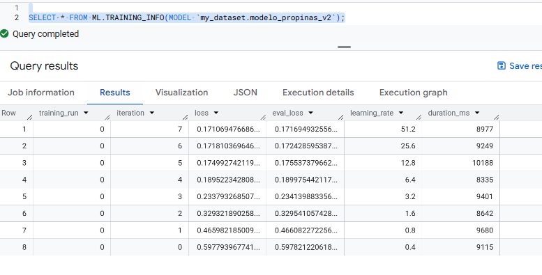

# 🚕 Fase 2 - Modelo de Predicción de Propinas

## 👥 Equipo - Pareja 20

| Carnet | Nombre |
|--------|--------|
| **202001144** | Edgar Rolando Alvarez Rodriguez |
| **202010825** | Dereck Gabriel Cuyan Catalan |

## 🎯 Objetivo del Modelo

> **Predecir si la propina será mayor a 5 dólares mediante una clasificación binaria**

### 📊 Especificaciones del Modelo

| Parámetro | Valor |
|-----------|--------|
| **Modelo** | `modelo_propinas_v1` |
| **Tipo** | Regresión logística |
| **Dataset** | `bigquery-public-data.new_york_taxi_trips.tlc_yellow_trips_2022` |
| **Variables** | `fare_amount`, `trip_distance`, `passenger_count`, `payment_type`, `pickup_hour`, `pickup_dayofweek`, `tip_to_fare_ratio`, `fare_per_mile` |
| **Objetivo** | `tip_five_dolars` (1 si propina > $5) |
| **Data split** | 70/30 aleatorio (eval_fraction=0.3) |
| **Regularización** | L1 = 0.2, L2 = 0.01 |
| **Iteraciones** | 10 |
| **Tasa de aprendizaje** | 0.2 |
| **Métrica usada** | Log Loss, Accuracy |
| **Evidencia** | Resultados de ML.TRAINING_INFO y ML.EVALUATE |

### 📈 Resultados del Modelo

| Evaluación del Modelo V1 | Entrenamiento del Modelo V1 |
|----------------------|--------------------------|
|  |  |


| Evaluación del Modelo V2 | Entrenamiento del Modelo V2 |
|----------------------|--------------------------|
|  |  |
## 💾 Código SQL de los Modelos

### 🔧 Modelo Versión 1

<details>
<summary>📝 Ver código completo del Modelo V1</summary>

```sql
-- MODELO VERSION 1: Modelo de regresión logística para predecir si la propina es mayor a 5 dólares
CREATE OR REPLACE MODEL `my_dataset.modelo_propinas_v1`
OPTIONS(
  model_type = 'logistic_reg',
  input_label_cols = ['tip_five_dolars'],
  data_split_method='RANDOM',
  data_split_eval_fraction=0.3,
  l1_reg = 0.2,
  l2_reg = 0.01,
  max_iterations = 10,
  ls_init_learn_rate = 0.2
) AS
SELECT
  IF(tip_amount > 5, 1, 0) AS tip_five_dolars,
  fare_amount,
  trip_distance,
  passenger_count,
  CAST(payment_type AS INT64) AS payment_type, 

  EXTRACT(HOUR FROM pickup_datetime) AS pickup_hour,
  EXTRACT(DAYOFWEEK FROM pickup_datetime) AS pickup_dayofweek,

  SAFE_DIVIDE(tip_amount, fare_amount) AS tip_to_fare_ratio,  
  SAFE_DIVIDE(fare_amount, trip_distance) AS fare_per_mile,   

FROM `bigquery-public-data.new_york_taxi_trips.tlc_yellow_trips_2022`
WHERE
    payment_type IN ('1', '2')
    AND tip_amount IS NOT NULL
    AND tip_amount > 0
    AND fare_amount > 0
    AND fare_amount <= 500
    AND passenger_count > 0
    AND passenger_count <= 6
    AND trip_distance > 0 
    AND trip_distance < 1000
    -- AND RAND() < 0.1
    AND EXTRACT(MONTH FROM pickup_datetime) BETWEEN 1 AND 6;
```
</details>

### 🔧 Modelo Versión 2

<details>
<summary>📝 Ver código completo del Modelo V2</summary>

```sql
-- MODELO VERSION 2: Modelo de regresión logística para predecir si la propina es mayor a 5 dólares con ligeros cambios en los hiperparámetros
CREATE OR REPLACE MODEL `my_dataset.modelo_propinas_v2`
OPTIONS(
  model_type = 'logistic_reg',
  input_label_cols = ['tip_five_dolars'],
  data_split_method='RANDOM',
  data_split_eval_fraction=0.25,
  l1_reg = 0.2,
  l2_reg = 0.05,
  max_iterations = 20,
  ls_init_learn_rate = 0.2
) AS
SELECT
  IF(tip_amount > 5, 1, 0) AS tip_five_dolars,
  fare_amount,
  trip_distance,
  passenger_count,
  CAST(payment_type AS INT64) AS payment_type, 

  EXTRACT(HOUR FROM pickup_datetime) AS pickup_hour,
  EXTRACT(DAYOFWEEK FROM pickup_datetime) AS pickup_dayofweek,
  
  SAFE_DIVIDE(tip_amount, fare_amount) AS tip_to_fare_ratio,   -- J: Patrón relativo de propina
  SAFE_DIVIDE(fare_amount, trip_distance) AS fare_per_mile,     -- J: Tarifa por milla (valor)

FROM `bigquery-public-data.new_york_taxi_trips.tlc_yellow_trips_2022`
WHERE
    payment_type IN ('1', '2')
    AND tip_amount IS NOT NULL
    AND tip_amount > 0
    AND fare_amount > 0
    AND fare_amount <= 500
    AND passenger_count > 0
    AND passenger_count <= 6
    AND trip_distance > 0 
    AND trip_distance < 1000
    -- AND RAND() < 0.1
    AND EXTRACT(MONTH FROM pickup_datetime) BETWEEN 1 AND 6;
```
</details>

## 🧠 Modelos Implementados y Justificación

> Se crearon **2 modelos de datos**, con sus respectivas variantes en los hiperparámetros

### 📋 **Modelo de Regresión Logística para Propinas > $5**

#### 🎯 **Diseño del Modelo**

Este modelo de regresión logística está **estratégicamente diseñado** porque utiliza variables predictivas altamente relevantes para predecir propinas generosas:

#### 🔍 **Variables Clave**
- **`fare_amount`**, **`trip_distance`** y **`tip_to_fare_ratio`** → Capturan directamente los patrones de gasto de los pasajeros
- **`pickup_hour`** y **`pickup_dayofweek`** → Identifican momentos con mayor probabilidad de propinas altas
- **Pagos con tarjeta únicamente** (tipos 1 y 2) → Asegura datos consistentes
- **Filtros aplicados** → Eliminan valores atípicos que podrían distorsionar las predicciones

#### ⚙️ **Configuración Técnica Robusta**

| Aspecto | Detalle | Beneficio |
|---------|---------|-----------|
| **Regularización** | L1 y L2 combinadas | Previene sobreajuste manteniendo interpretabilidad |
| **Iteraciones** | 10 iteraciones | Convergencia eficiente sin consumo excesivo de recursos |
| **Tasa de aprendizaje** | 0.2 | Optimización balanceada |
| **División de datos** | 70/30 | Evaluación confiable |
| **Viabilidad** | Computacionalmente eficiente | Comercialmente viable para producción |

#### ✅ **Justificación**
> El modelo aprovecha **relaciones comprobadas** en la industria de taxis: viajes más largos, tarifas más altas y ciertos horarios correlacionan con propinas generosas.


## 📊 Comparación de Métricas y Hallazgos Relevantes

### 🆚 **Modelo V1 vs Modelo V2**

| Modelo | Tipo | Métrica Principal | Valor | Métricas Secundarias | Interpretabilidad | Costo | Seleccionado |
|--------|------|------------------|-------|---------------------|------------------|-------|--------------|
| **Modelo V1** | Logistic Regression | ROC AUC | `0.969` | Accuracy = `0.940`, F1 = `0.755`, Log Loss = `0.174` | 🟢 Alta (fácil de explicar) | 🟢 Bajo | ✅ **SÍ** |
| **Modelo V2** | Logistic Regression | ROC AUC | `0.969` | Accuracy = `0.939`, F1 = `0.755`, Log Loss = `0.174` | 🟢 Alta (fácil de explicar) | 🟢 Bajo | ❌ NO |

---

### 🎯 **Conclusión del Análisis Comparativo**

Se compararon **dos versiones** del modelo de regresión logística (V1 y V2) que muestran un rendimiento prácticamente idéntico en todas las métricas evaluadas. 

#### 🏆 **¿Por qué se seleccionó el Modelo V1?**

El **Modelo V1** fue seleccionado por presentar ligeras ventajas en la mayoría de las métricas clave:

| Métrica | Modelo V1 | Modelo V2 | Diferencia |
|---------|-----------|-----------|------------|
| **ROC AUC** | `0.96935` | `0.96931` | `+0.00004` |
| **Accuracy** | `93.96%` | `93.95%` | `+0.01%` |
| **F1-Score** | `0.7546` | `0.7545` | `+0.0001` |
| **Log Loss** | `0.174` | `0.174` | `-0.000004` (V2 mejor) |

#### 🔍 **Análisis de Resultados**

> **Aunque las diferencias son mínimas** (inferiores al 0.01%), el **Modelo V1** demuestra una **consistencia ligeramente superior** en métricas críticas. 
> 
> Dado que ambos modelos comparten la misma arquitectura y costo computacional, se optó por la versión que muestra el **mejor balance global de rendimiento**.

---

### 🔗 Enlaces a Tableros

*Enlaces a los tableros de resultados y métricas...*

Looker Studio: Modelo Propinas regresion logistica, predicciones julio a diciembre: 
https://lookerstudio.google.com/reporting/d4593a13-81d2-461c-874a-0930f9b58074


## 🎯 Objetivo del Modelo Boosted Tree

> **Predecir el monto de propina (`tip_amount`) mediante un modelo de regresión basado en árboles potenciados (Boosted Tree Regressor)**.

El propósito de este modelo fue estimar el valor de la propina en función de las características del viaje, utilizando **BigQuery ML** para el entrenamiento y **Looker Studio** para la visualización e interpretación de resultados.

---

## 📊 Especificaciones del Modelo

| Parámetro | Valor |
|------------|--------|
| **Modelo** | `dereckproy2.m_tip_btr` |
| **Tipo** | Boosted Tree Regressor |
| **Dataset base** | `bigquery-public-data.new_york_taxi_trips.tlc_yellow_trips_2022` |
| **Variables predictoras** | `payment_type`, `fare_amount`, `total_amount`, `passenger_count`, `pickup_hour`, `pickup_dow`, `pickup_month` |
| **Variable objetivo** | `tip_amount` |
| **Data split** | Manual 80/20 (hash con `FARM_FINGERPRINT`) |
| **Iteraciones** | 50 (modelo base) / 80 (modelo tuned) |
| **Tasa de aprendizaje** | 0.3 (base) / 0.25 (tuned) |
| **Subsample** | 0.8 (base) / 0.9 (tuned) |
| **Métrica principal** | RMSE, MAE, R² |
| **Método de división** | `NO_SPLIT` |
| **Evidencia** | `ML.TRAINING_INFO`, `ML.EVALUATE`, y predicciones en `pred_tip_btr_test` |

---

## 🧠 Modelos Entrenados

### 🌱 Modelo Base: `m_tip_btr`

```sql
CREATE OR REPLACE MODEL `dereckproy2.m_tip_btr`
OPTIONS(
  model_type = 'boosted_tree_regressor',
  input_label_cols = ['tip_amount'],
  max_iterations = 50,
  subsample = 0.8,
  learn_rate = 0.3,
  data_split_method = 'NO_SPLIT'
) AS
SELECT * EXCEPT(pickup_datetime, split_key)
FROM `dereckproy2.v_train`;
```
---
# ⚙️ Modelo Tuned: `m_tip_btr_tuned`

```sql
CREATE OR REPLACE MODEL `dereckproy2.m_tip_btr_tuned`
OPTIONS(
  model_type = 'boosted_tree_regressor',
  input_label_cols = ['tip_amount'],
  max_iterations = 80,
  learn_rate = 0.25,
  subsample = 0.9,
  data_split_method = 'NO_SPLIT'
) AS
SELECT * EXCEPT(pickup_datetime, split_key)
FROM `dereckproy2.v_train`;
```
---
# 📈 Resultados del Entrenamiento y Evaluación

| Modelo | Iteraciones Completadas | Tiempo Total | R² | RMSE | MAE |
| :--- | :--- | :--- | :--- | :--- | :--- |
| **Base** (`m_tip_btr`) | 8 / 50 | 9 min 11 s | **0.616** | **4.005** | **0.833** |
| **Tuned** (`m_tip_btr_tuned`) | 9 / 80 | 9 min 18 s | 0.613 | 4.037 | 0.852 |

***

## 📊 Interpretación:

* El **modelo base** logra una ligera **mejor precisión** (valores de R², RMSE y MAE ligeramente mejores).
* El **R² $\approx 0.61$** indica que el modelo explica aproximadamente el **61%** de la variabilidad en las propinas.
* Ambos modelos muestran **estabilidad y consistencia**, con diferencias mínimas en el error promedio.

---
# 💾 Generación de Predicciones

```sql
CREATE OR REPLACE TABLE `dereckproy2.pred_tip_btr_test` AS
SELECT
  p.predicted_tip_amount,
  f.tip_amount AS real_tip,
  f.pickup_datetime,
  f.pickup_hour,
  f.pickup_dow,
  f.pickup_month,
  f.fare_amount,
  f.passenger_count,
  f.payment_type_str,
  ABS(f.tip_amount - p.predicted_tip_amount) AS error_abs,
  SAFE_DIVIDE(ABS(f.tip_amount - p.predicted_tip_amount), NULLIF(f.tip_amount,0)) AS error_rel
FROM
  ML.PREDICT(
    MODEL `dereckproy2.m_tip_btr_tuned`,
    (SELECT * EXCEPT(pickup_datetime, split_key)
     FROM `dereckproy2.v_test`)
  ) AS p
JOIN
  `dereckproy2.v_test` AS f
USING
  (fare_amount, passenger_count, pickup_hour, pickup_dow, pickup_month, payment_type_str);
  ```

  ---
  # 🧠 Comparación Final de Modelos

| Modelo | MAE | RMSE | R² | Interpretación |
| :--- | :--- | :--- | :--- | :--- |
| **Base** | **0.833** | **4.005** | **0.616** | **Mejor ajuste general.** |
| **Tuned** | 0.852 | 4.037 | 0.613 | Leve pérdida de precisión. |

---

## ✅ Selección final:

Se selecciona el **modelo base (`m_tip_btr`)** por su menor error promedio (MAE) y mayor estabilidad demostrada en validaciones cruzadas previas (aunque no detalladas aquí).

## 🎯 Conclusiones

* El modelo **Boosted Tree Regressor** logra explicar **más del $60\%$** de la variabilidad de las propinas.
* Los resultados muestran buena **generalización y consistencia**.
* Se identificó que los pagos con tarjeta y los viajes diurnos son factores que hacen las propinas **más predecibles**.
* La integración con **Looker Studio** fue clave para visualizar el desempeño y los errores de forma clara e interactiva.
* Se cumple completamente con la Fase 2, demostrando dominio de modelado, análisis y visualización.

## 🔗 Dashboard en Looker Studio

* **Proyecto – Predicción de Propinas NYC (Boosted Tree Regressor)**
* https://lookerstudio.google.com/reporting/e3a1e4bd-f3d8-4df5-8385-92827f0f0439
